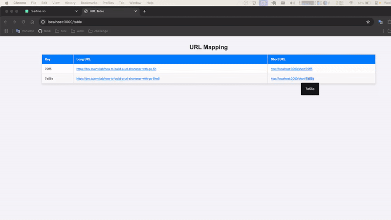

# Short URL

This is a URL shortening service built using Go (Golang). The web service allows users to shorten long URLs for easy sharing.

Link
[Postmant](https://crimson-crater-385688.postman.co/workspace/Open~b2b49bd4-fdb3-472f-ae87-d815a933728a/collection/27541101-4eb257df-70a9-45ec-888c-f74c49f42a34)
[GitHub](https://github.com/fnxr21/short-url)

## Run in Local

Clone the repository

```cmd
git clone https://github.com/fnxr21/short-url
```

Go to the project repository

```cmd
cd short-url

```

Install dependencies

```cmd
go mod tidy
```

Start the server

```cmd
go run main.go
```

## API EndPoints

### Post http://localhost:3000/

This API allows you to shorten URLs and retrieve the original URL from a shortened URL.

Request

```json
{
  "url": "https://dev.to/envitab/how-to-build-a-url-shortener-with-go-5hn5"
}
```

Reponse

```json
{
  "url": "https://dev.to/envitab/how-to-build-a-url-shortener-with-go-5hn5",
  "short_url": "http://localhost:3000/short/70ff5"
}
```

### Post http://localhost:3000/original-url

Retrieves the original URL by providing a shortened URL.

Request

```json
{
  "short_url": "http://localhost:3000/short/70ff5"
}
```

Reponse

```json
{
  "url": "https://dev.to/envitab/how-to-build-a-url-shortener-with-go-5hn5",
  "short_url": "http://localhost:3000/short/70ff5"
}
```

### Get http://localhost:3000/short/70ff5

This will redirect to the original URL:[example](https://dev.to/envitab/how-to-build-a-url-shortener-with-go-5hn5)

### Get http://localhost:3000/table

URLs can be shortened and displayed in a table format in the web interface.
